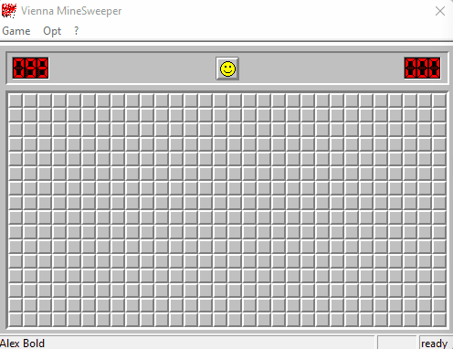
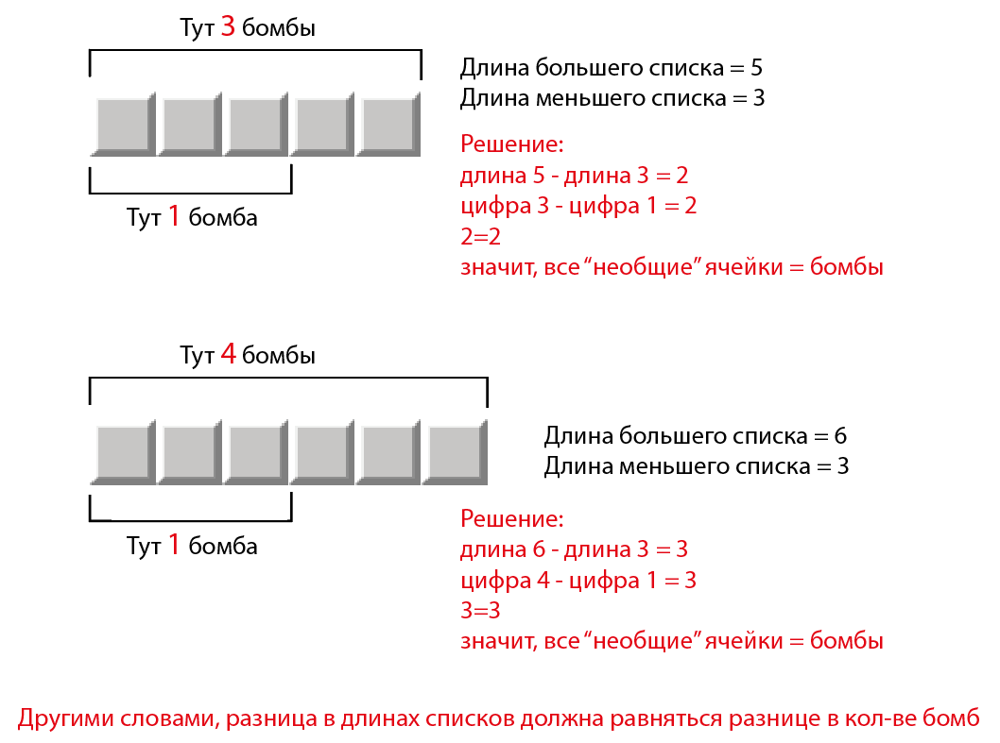
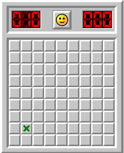

Very early alpha demo (only 1 solve strategy):  
----------------------------------------

Demo 2 (3 solve strategy):  
----------------------------------------

Demo 3 (5 solve strategy):  
----------------------------------------

TODO
----------------------------------------  

[x] MatchTemplate занимает до 25-50% времени выполнения. Надо с этим что-то делать  
[ ] Написать тесты?  
[x] Возможность остановить выполнение по нажатию клавиши  
[ ] Выяснить, что не так с red bomb (особенно когда красная бомба последняя = баг)
[ ] asset_24_1920x1080 (а может быть, и другие ассеты) не распознает окончание игры, если взорвались на последней бомбе (т.е. на поле только одна бомба и она красная)
[x] Реализовать режим [без флагов](https://minesweeper.online/ru/help/gameplay) (NF)  
[x] Режим NG  
[-] TODO можно делать движения мыши более "человеческими" PS Нет смысла, движения не пишутся, только время между кликами.    
[x] Сделать настройки через settings.ini  
[x] Сделать слой абстракции конкретной реализации сапера  
[x] Сделать в ридми описание стратегий  
[ ] Хочу, чтобы можно было так делать: `if bomb in matrix:`, или, если у нас есть array of cells - `if bomb in array`  
[ ] Разобраться, где и как используются cell.status и cell.type  
[x] Перед выполнением R1 сохранять скриншот и pickle  
[x] Печатать время после игры  
[ ] Считать потраченные на игру клики  
[ ] Научить солверы быть "[эффективными](https://minesweeper.online/ru/help/efficiency)". Для этого можно выявлять все возможные решения и применять тот, который открывает максимум клеток.  
[x] Сделать время движения мыши зависимо от расстояния между клетками  
[x] Solver B2E2 возвращает набор клеток - получается, что они могут открыться после нажатия на первую клетку, а он все равно ползает и кликает по уже открывшимся    
[ ] Если в начале игры на поле обнаруден крест - автоматически ставить игру в режим No Guess    
[x] Проверять, все ли файлы ассета в наличии  
[x] Провести эксперимент - играть руками в сапера на разных размерах и питоном записать распределение времени между кликами    
[ ] Можно находить координаты для клика Reset автоматом по smile.png  
[ ] непонятно, откуда брать настройки... многие сначала импортируются в asset, а потом напрямую берутся из config  
[x] move asset.py to settings.ini  
[ ] Считать количество фейлов в начале, середине, и конце игры  
[ ] Сделать солвер для эндшпиля, когда все предполашаемые места оставшихся бомб известны, и значит можно открыть остальные клетки.
[ ] Сделать только одну цель по общему кол-ву сыгранных партий и добавить "выиграно подряд" 
[ ] Переписать модуль распознавания, а то у нас сейчас в трех местах (скан доски, красные цифры и поле)
[ ] В скане экрана сделать удобный дебаг, чтобы смотреть что происходит

Code Explanation
======================

#### NF mode

NoFlag должен, по логике, работать так:

- флаги нужно хранить в matrix. Сейчас фла но не отображаются на поле
- при *сканировании* поля пустые ячейки не должны заменять флаги в matrix.
  - реализация: на самом деле, мы обновляем не все поле, а только те ячейки, которые в матрице обозначены как закрытые. 
    Таким образом, флаги не затираются. Тут никаких изменений в коде не требуется.
- при клике мы должны проверить, если пытаемся поставить флаг, пропускать этот шаг
  - реализация:

Targets and indicators
=======================

Engine speed
-----------------

Измеряется на Vienna Minesweeper с нулевыми задержками на Professional поле. Показывает общую скорость движка и
потенциальные бутылочные горлышки.

No guess solving
---------------------

Показывает мощь алгоритмов. В no guess досках всегда есть решение и не применяется случайный выбор. Процент
решенных досок показывает, насколько "умны" алгоритмы решений. Выполняется на online-сапере.

Guess percentage
---------------------

Аналогично предыдущему, но так же задействует алгоритм выборы случайной клетки. Выполняется на Vienna с большими
выборками.

Efficiency
------------------

Значение 3BV, поделенное на количество кликов. Требует особой настройки алгоритмов. Сейчас можно просто произвести замеры.
Требует технологии подсчета 3BV, пока не реализовано.

R1 fail chance
----------------------

Подсчитать на длинных прогонах, сколько раз ошибается R1 обычный и сколько раз он будет ошибаться после
вычислений вероятности нахождения бомб 

Алгоритмы
===================

### solver_R1

> Нажимает рандомную ячейку из закрытых.

Применяется в начале партии, или когда другие солверы не могут найти решения.

### solver_R1_corner

> Нажимает рандомную ячейку из закрытых углов. Эффективность под вопросом.

### solver_R1_smart

> Выбирает из закрытых клеток наиболее вероятную не содержащую бомб.

### solver_B1

>BOMB1. Умеет только помечает бомбами. Проверяем все ячейки с цифрами.
Если цифра в ячейке равно кол-ву соседних закрытых клеток 
(включая клетки с флагами),
ТО все оставшиеся неоткрытые клетки - бомбы.

Простейший алгоритм.

### solver_E1

>EMPTY1. Умеет только открывать ячейки. Проверяем все ячейки с цифрами.
Если вокруг ячейки с цифрой такое же кол-во флагов, и вокруг есть закрытые
ячейки, ТО все закрытые ячейки вокруг являются пустыми.
Алгоритм сканирует все поле по этому принципу, затем возвращает ту ячейку,
у которой максимальное кол-во пустых клеток.

Простейший алгоритм. В сочетании с B1 и R1 уже может открывать некоторые поля.

### solver_B1E1

> Объедененный солвер B1+E1, за счет оптимизации.

### solver_B2

- усовершенстованный solver для поиска бомб B(obm)2
- Для каждой цифры делаем список закрытых ячеек
- Если один набор полностью входит во второй
- Из ЦИФРЫ списка (вокруг которой root) вычитаем кол-во уже открытых флагов
- Сравниваем два корня (каждый с каждым).
- Находим совпадения:
   `Цифра` первого корня + `Цифра` второго корня + разница в длине между корнями = длина большего корня.
   Вот эту разницу - отмечаем бомбами.

 
### solver_E2

- усовершенстованный solver для поиска пустых ячеек E(mpty)2
- Для каждой открытой цифры делаем список закрытых ячеек вокруг 
- При этом нужно из цифры вычесть кол-во имеющихся вокруг флагов
- Сравниваем каждый список с каждым. Ищем вхождение одного списка в другой.
- Если при этом цифры одинаковые (с учетом вычета флагов), то все "лишние" ячейки - пустые (их может быть более 1-й)

### solver_human 

Передает управление человеку на n секунд, если нет ходов.

solver_human_almost_work.py - немного другая реализания, и она не работает.

### solver_noguess

Первый ход для no-guess игр. Это когда игра помечает крестиком хороший первый ход.
Нажимает отмеченную крестиком клетку.

Perfomance
====================

see [perfomance](perfomance.md)

MBF file format
======================
It's a file format for holding boards by listing the mines used by MinesweeperX.  If I remember correctly; 2 bytes for # of mines, 1 byte for width, 1 byte for height then for each mine: 1 bytes for X and 1 byte for Y.

Libraries
========================

opencv
-------------

Real-time computer vision.

pywinauto
--------------

**[not used]** pywinauto is a set of python modules to automate the Microsoft Windows GUI. At its simplest it allows you to send mouse and keyboard actions to windows dialogs and controls, but it has support for more complex actions like getting text data.  
 [github](https://github.com/pywinauto/pywinauto)

pyautogui
-----------------

**[not used]** PyAutoGUI is a cross-platform GUI automation Python module for human beings. Used to programmatically control the mouse & keyboard.  
 [github](https://github.com/asweigart/)

python-imagesearch
-------------------

**[not used]** search the screen for a specific element  
 [github](https://github.com/drov0/python-imagesearch)

mouse
-----------
Controlled mouse (at 100 times faster of pyautogui)
 [github](https://github.com/boppreh/mouse)

pynput
----------
Еще одна библиотека для контроля клавиатуры и мыши. С ее помощью получилось разделить на разные потоки
прослушиватель клавиатуры и основной процесс.

mss
---------

An ultra fast cross-platform multiple screenshots module in pure python using ctypes.

pywin32
----------

Низкоуровневые привязки для Window's win32 GUI API. Позволяет рисовать прямо на экране, что удобно для визуального 
дебага алгоритмов.

Articles and Algorithms
==================

Automate gaming with python  
 [You never get bored playing with Computer Vision](https://towardsdatascience.com/you-never-get-bored-playing-with-computer-vision-cb93cbd3274a)

Search the screen for a specific element  
 [Easy Image recognition for automation with python](https://medium.com/@martin.lees/image-recognition-for-automation-with-python-711ac617b4e5)  
 [How to easily image search with python](https://brokencode.io/how-to-easily-image-search-with-python/)  

Крутая статья по вероятностям в эндшпиле
[Minesweeper: Advanced Tactics](http://www.nothings.org/games/minesweeper/)  

[How to Write your own Minesweeper AI](https://luckytoilet.wordpress.com/2012/12/23/2125/)  
[-- and it's reddit thread](https://www.reddit.com/r/programming/comments/15c4e1/how_to_write_your_own_minesweeper_ai_very/)    
[Logic solver aka PROLOG](https://dev.to/krlove/creating-advanced-minesweeper-solver-using-logic-programming-2ppd)  
[Solving Minesweeper with Matrices](https://massaioli.wordpress.com/2013/01/12/solving-minesweeper-with-matricies/)  
[Another matrix solution](https://quantum-p.livejournal.com/19616.html)  

[First click probability](https://minesweepergame.com/website/tim-kostka/firstclick.html)
[TLM Theory](https://minesweepergame.com/website/tim-kostka/tlmtheory.html)
  
[Minesweeper and NP-completeness](http://web.mat.bham.ac.uk/R.W.Kaye/minesw/ordmsw.htm)  
[Algorithmic Approaches to Playing Minesweeper PDF](https://pdfhost.io/v/uvgsPGU7Y_Algorithmic_Approaches_to_Playing_Minesweeper)  
[reddit](https://www.reddit.com/r/Minesweeper/comments/8b3b30/odds_of_winning_at_minesweeper/)  
[Официальное сообщество Minesweeper](https://www.reddit.com/r/Minesweeper/)  
[Авторитетный сапер](http://www.minesweeper.info/)  
[-- Почти все саперы скачать](https://www.minesweeper.info/downloads/SuperMinesweeper.html)
[Вероятности закрытых ячеек](https://docs.google.com/document/d/10YxF7QWxqVcl2Cgxo_mu6Q33uUjKxb9Q0F5gmp3r74c/edit)  
[Algorithms for Minesweeper Game Grid Generation](https://dspace.cvut.cz/bitstream/handle/10467/68632/F3-BP-2017-Cicvarek-Jan-Algorithms%20for%20Minesweeper%20Game%20Grid%20Generation.pdf)  
[Puzzling StackExchange](https://puzzling.stackexchange.com/search?page=1&tab=Relevance&q=minesweeper)  
[Minesweeper Board Museum](https://mzrg.com/js/mbm/index.html)  

[Большое сборник статей по мат. алгоритмам](https://minesweepergame.com/math-papers.php)  

Human strategy
-----------------------
[Strategy wiki](http://www.minesweeper.info/wiki/Strategy)  
[Minesweeper Strategy](https://minesweepergame.com/strategy.php)

Non algorithm articles
-------------------------
[Minesweeper and Hypothetical Thinking Action Research](https://files.eric.ed.gov/fulltext/ED509464.pdf)  

Minesweeper boards
-------------------------

[Miner online another](https://mines.zone/ru/)  
[Minesweeper-X](https://minesweepergame.com/download/minesweeper-x.php)  
[Arbiter](https://minesweepergame.com/download/arbiter.php)  
[Viennasweeper](https://minesweepergame.com/download/viennasweeper.php)  
[minesweeper.online](https://minesweeper.online/)  
[Google minesweeper](https://www.google.com/fbx?fbx=minesweeper)  
[minesweeperonline.com](https://minesweeperonline.com/)  
[Analize bot](https://davidnhill.github.io/JSMinesweeper/)  
