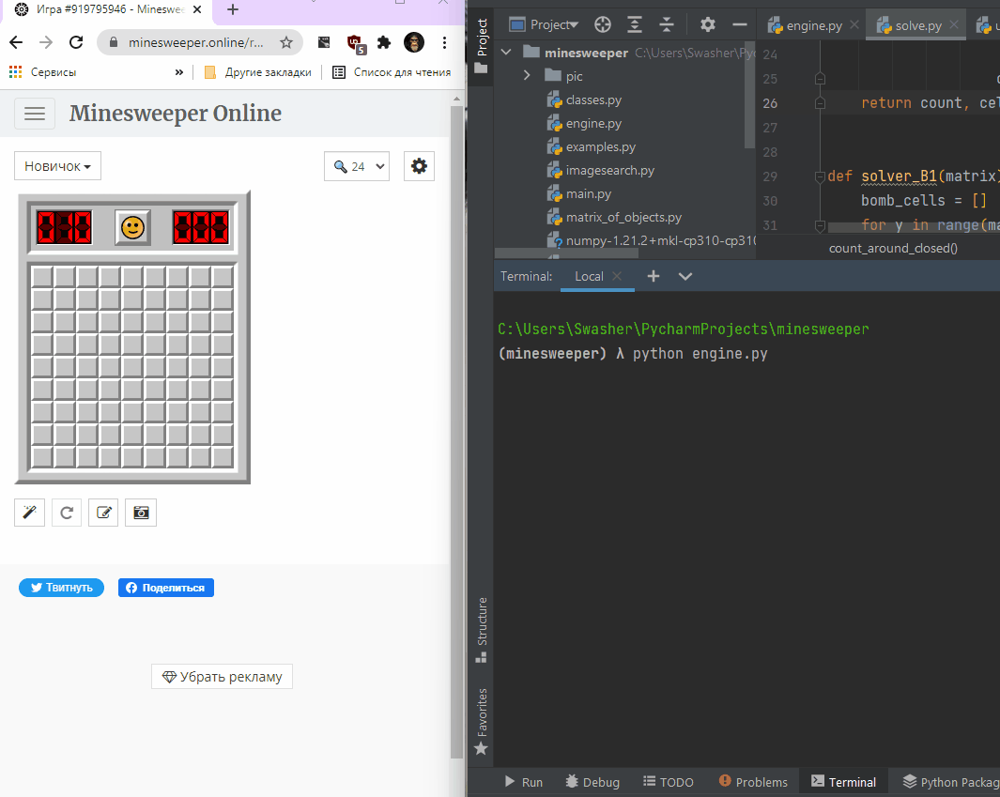
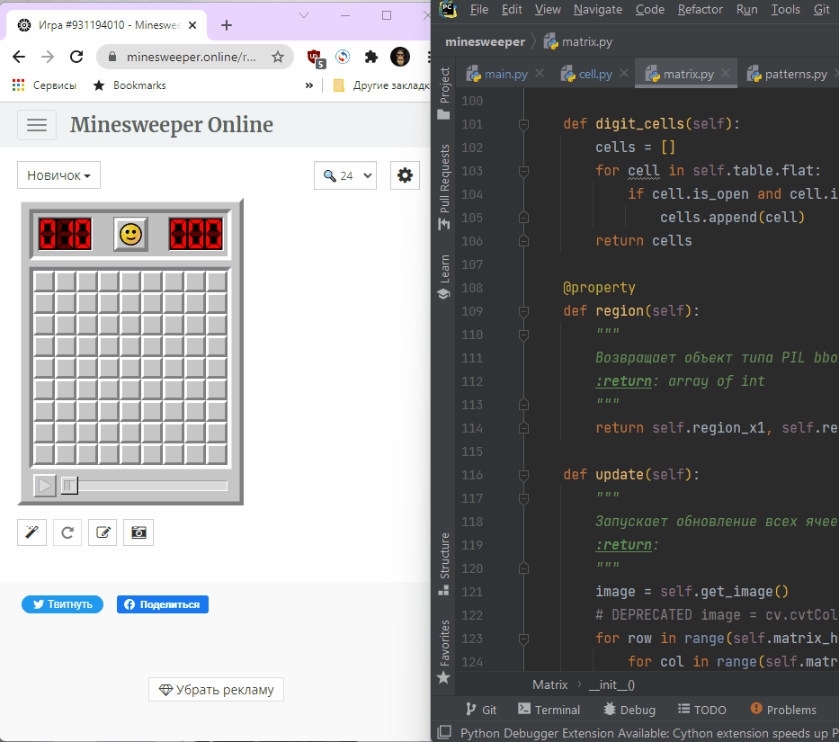

Very early alpha demo (only 1 solve strategy):  
----------------------------------------

Demo 2 (3 solve strategy):  
----------------------------------------

TODO
======================

[ ] MatchTemplate занимает до 25-50% времени выполнения. Надо с этим что-то делать  
[ ] Написать тесты?  
[ ] Возможность остановть выполнение по нажатию клавиши  
[ ] Выяснить, что не так с red bomb (особенно когда красная бомба последняя = баг)
[ ] Реализовать режим [без флагов](https://minesweeper.online/ru/help/gameplay) (NF)
[ ] Режим NG
[-] TODO можно делать движения мыши более "человеческими" PS Нет смысла, движения не пишутся, только время между кликами.  
[x] Сделать настройки через settings.ini  
[ ] Сделать слой абстракции конкретной реализации сапера  
[ ] Сделать в ридми описание стратегий
[ ] Хочу, чтобы можно было так делать: `if bomb in matrix:`, или, если у нас есть array of cells - `if bomb in array`
[ ] Разобраться, где и как используются cell.status и cell.type
[ ] Перед выполнением R1 сохранять скриншот и pickle
[ ] Печатать время после игры
[ ] Считать потраченные на игру клики
[ ] Научить солверы быть "[эффективными](https://minesweeper.online/ru/help/efficiency)". Для этого можно выявлять все возможные решения и применять тот, который открывает максимум клеток.

Installation
=====================

Numpy
------------

Для винды нужны прекомпилированные пакеты, иначе придется их либо через conda устанавливать (что ведет к ебле с 
окружением, ибо у конды свое), либо нужно тянуть 4-6 гигов майкрасофтовских компиляторов. Брал отсюда
https://www.lfd.uci.edu/~gohlke/pythonlibs/#numpy

Opencv
-------------

аналогично

для установки opencv нужно установить это:  
[Microsoft Visual C++ Redistributable for Visual Studio 2015, 2017 and 2019](https://docs.microsoft.com/en-US/cpp/windows/latest-supported-vc-redist?view=msvc-160)

Libraries
========================

opencv
-------------

Real-time computer vision.

pywinauto
--------------

**[not used]** pywinauto is a set of python modules to automate the Microsoft Windows GUI. At its simplest it allows you to send mouse and keyboard actions to windows dialogs and controls, but it has support for more complex actions like getting text data.  
 [github](https://github.com/pywinauto/pywinauto)

pyautogui
-----------------

**[not used]** PyAutoGUI is a cross-platform GUI automation Python module for human beings. Used to programmatically control the mouse & keyboard.  
 [github](https://github.com/asweigart/)

python-imagesearch
-------------------

**[not used]** search the screen for a specific element  
 [github](https://github.com/drov0/python-imagesearch)

mouse
-----------
Controlled mouse (at 100 times faster of pyautogui)
 [github](https://github.com/boppreh/mouse)

Articles and Algorithms
==================

Automate gaming with python  
 [You never get bored playing with Computer Vision](https://towardsdatascience.com/you-never-get-bored-playing-with-computer-vision-cb93cbd3274a)

Search the screen for a specific element  
 [Easy Image recognition for automation with python](https://medium.com/@martin.lees/image-recognition-for-automation-with-python-711ac617b4e5)  
 [How to easily image search with python](https://brokencode.io/how-to-easily-image-search-with-python/)  

[Reddit - how_to_write_your_own_minesweeper_ai_very](https://www.reddit.com/r/programming/comments/15c4e1/how_to_write_your_own_minesweeper_ai_very/)    
[How to Write your own Minesweeper AI](https://luckytoilet.wordpress.com/2012/12/23/2125/)   
[Solving Minesweeper with Matrices](https://massaioli.wordpress.com/2013/01/12/solving-minesweeper-with-matricies/)  
[Minesweeper: Advanced Tactics](http://www.nothings.org/games/minesweeper/)  
[Strategy wiki](http://www.minesweeper.info/wiki/Strategy)  
[Minesweeper Strategy](https://minesweepergame.com/strategy.php)
[Minesweeper and NP-completeness](http://web.mat.bham.ac.uk/R.W.Kaye/minesw/ordmsw.htm)  
[Algorithmic Approaches to Playing Minesweeper PDF](https://pdfhost.io/v/uvgsPGU7Y_Algorithmic_Approaches_to_Playing_Minesweeper)  
[reddit](https://www.reddit.com/r/Minesweeper/comments/8b3b30/odds_of_winning_at_minesweeper/)  
[Официальное сообщество Minesweeper](https://www.reddit.com/r/Minesweeper/)
[Minesweeper and Hypothetical Thinking Action Research & Pilot Study PDF](https://files.eric.ed.gov/fulltext/ED509464.pdf)

[Большое сборник статей по мат. алгоритмам](https://minesweepergame.com/math-papers.php)

Minesweeper boards
-------------------------

[Miner online another](https://mines.zone/ru/)  
[Minesweeper-X](https://minesweepergame.com/download/minesweeper-x.php)  
[Arbiter](https://minesweepergame.com/download/arbiter.php)  
[Viennasweeper](https://minesweepergame.com/download/viennasweeper.php)  
[minesweeper.online](https://minesweeper.online/)  
[Google minesweeper](https://www.google.com/fbx?fbx=minesweeper) 
